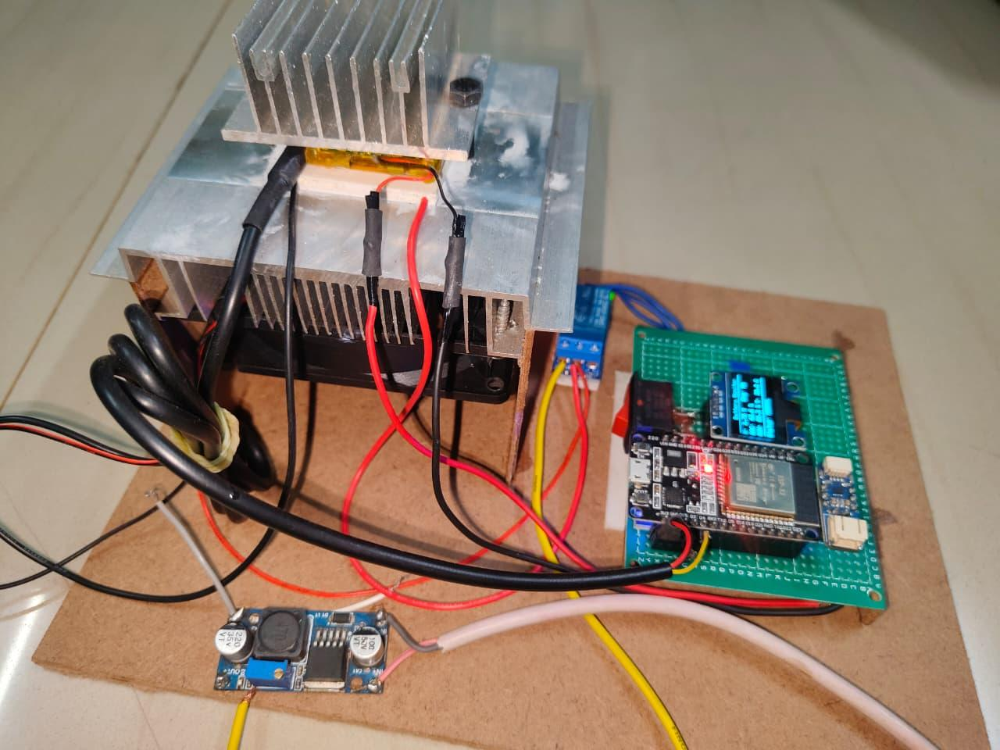
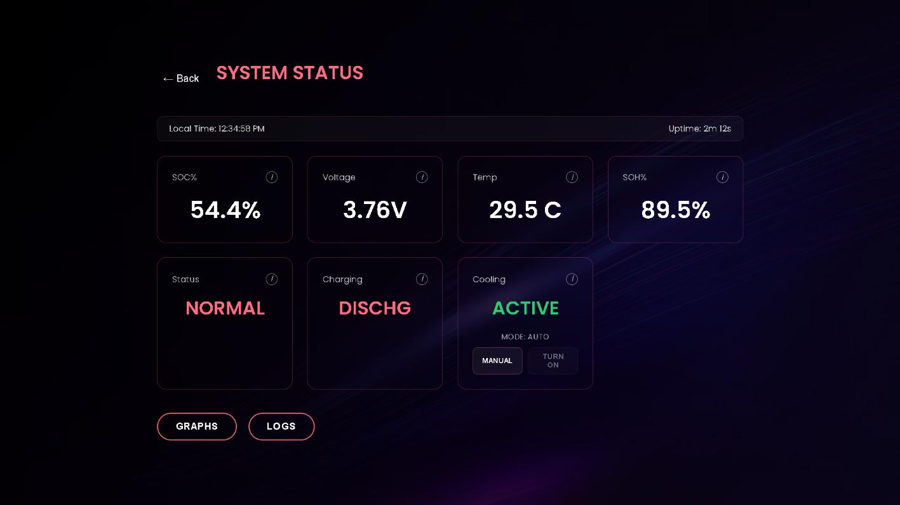
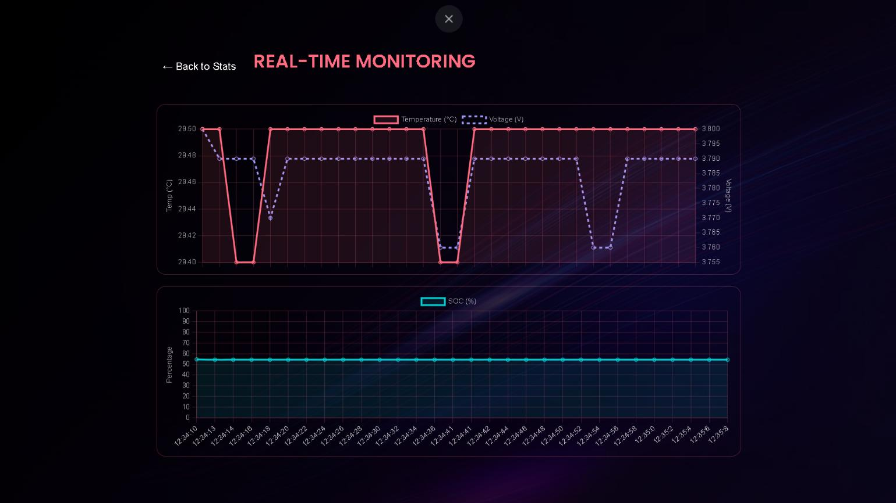

<div align="center">

# ⚡ EV Battery Thermal Regulation & Telemetry System

### Dual-Core ESP32 Firmware for Autonomous Battery Cooling with a Live Embedded Web Dashboard


</div>

---

## Overview

Lithium-based EV battery packs lose capacity and, in extreme cases, become unsafe when operated outside a narrow thermal window. Most hobbyist battery monitors stop at *reporting* — a number on a screen, a value in an app — and leave the human to notice a problem and react to it.

This project takes the sensing a step further into control. An **ESP32** reads battery temperature (DS18B20) and voltage/state-of-charge (MAX17048 fuel gauge) on a dedicated FreeRTOS task, drives a Peltier (TEC) module through a MOSFET to regulate temperature within a target band, and serves a self-hosted web dashboard — built with vanilla JS and Chart.js — directly from the ESP32's onboard flash (SPIFFS), reachable at `http://ev-bms.local` via mDNS with no IP lookup required.

It is a compact, single-board demonstration of three things at once: **embedded sensing**, **closed-loop hardware control**, and **an IoT-style local web service**, all running concurrently on one dual-core microcontroller.

---

## Preview

**Hardware Prototype**

<p align="center"></p>

**Live Dashboard**

<p align="center"></p>

**Real-Time Monitoring Graphs**

<p align="center"></p>

---

## What It Actually Does

| Capability | Detail |
|---|---|
| Temperature sensing | Single DS18B20 (1-Wire) probe on the battery pack |
| Voltage / SOC | MAX17048 fuel-gauge IC over I²C |
| SOH estimate | Derived heuristic: `(voltage / 4.20) × 100`, clamped 0–100 (see *Known Limitations*) |
| Charge detection | Heuristic: voltage ≥ 4.0 V is treated as "charging" — there's no dedicated charge-sense line |
| Active cooling | MOSFET-switched Peltier (TEC) module, hysteresis-controlled |
| Local alerting | Piezo buzzer pulses on any non-`NORMAL` status |
| Local display | 128×64 SSD1306 OLED, refreshed every 2 s |
| Remote telemetry | REST-style JSON endpoint, polled by the browser every 2 s |
| Manual override | Dashboard can switch cooling from AUTO to MANUAL and force it ON/OFF |
| Discovery | mDNS hostname `ev-bms.local` — no need to hunt for a DHCP-assigned IP |

---

## System Architecture

The firmware splits work across the ESP32's two cores rather than doing everything inside a single `loop()`:

```text
                         ┌───────────────────────────┐
                         │        Battery Pack        │
                         └────────────┬───────────────┘
                     ┌────────────────┴────────────────┐
                     ▼                                  ▼
             DS18B20 (1-Wire)                  MAX17048 (I²C Fuel Gauge)
                     │                                  │
                     └────────────────┬─────────────────┘
                                       ▼
                        ┌───────────────────────────┐
                        │   CORE 0 — "SensorOLED"    │
                        │   FreeRTOS task (2 s loop) │
                        │                            │
                        │  • Read temp / voltage/SOC │
                        │  • Compute status & SOH    │
                        │  • Drive OLED + buzzer     │
                        │  • Peltier hysteresis logic│
                        └────────────┬───────────────┘
                                     │  writes under mutex
                                     ▼
                        ┌───────────────────────────┐
                        │   SharedData (protected    │
                        │   by a FreeRTOS mutex)     │
                        └────────────┬───────────────┘
                                     │  reads under mutex
                                     ▼
                        ┌───────────────────────────┐
                        │   CORE 1 — Arduino loop()  │
                        │   Synchronous WebServer    │
                        │                            │
                        │  • Serves SPIFFS static    │
                        │    files (dashboard)       │
                        │  • GET /api/data (JSON)    │
                        │  • GET /api/control        │
                        └────────────┬───────────────┘
                                     │  HTTP / JSON over Wi-Fi
                                     ▼
                        ┌───────────────────────────┐
                        │   Browser Dashboard        │
                        │   HTML + CSS + Chart.js    │
                        │   polling every 2 s        │
                        └────────────────────────────┘
```

The important structural point: **one** task (`TaskCore0`) is explicitly created and pinned to core 0; core 1 runs the default Arduino `loop()`, which pumps `server.handleClient()`. Both sides touch a shared `SharedData` struct, so every read and write to it is wrapped in `xSemaphoreTake` / `xSemaphoreGive` on a single mutex. That mutex is the entire concurrency-safety story of this firmware — it's simple, but it is real and it is necessary, since the sensor task and the HTTP handler run on different cores and could otherwise race on the same memory.

---

## Hardware

| Component | Interface | Role |
|---|---|---|
| ESP32 Dev Board | — | Dual-core controller running FreeRTOS + Wi-Fi stack |
| DS18B20 | 1-Wire (GPIO 4) | Battery pack temperature |
| MAX17048 | I²C (SDA 21 / SCL 22) | Voltage + state-of-charge fuel gauge |
| SSD1306 OLED (128×64) | I²C, addr `0x3C` | Local status readout |
| N-channel MOSFET | GPIO 18 (active-low switching) | Switches Peltier module power |
| TEC / Peltier Module | Driven via MOSFET | Active cooling element |
| Piezo Buzzer | GPIO 5 | Audible alert on abnormal status |

### Pin Map

| Signal | GPIO |
|---|---|
| I²C SDA | 21 |
| I²C SCL | 22 |
| DS18B20 Data (1-Wire) | 4 |
| Buzzer | 5 |
| Peltier / MOSFET Gate | 18 |

---

## Software Stack

**ESP32 core / built-in libraries:** `WiFi.h`, `WebServer.h`, `ESPmDNS.h`, `SPIFFS.h`, `Wire.h`

**External libraries (`platformio.ini`):**

| Library | Purpose |
|---|---|
| `SparkFun MAX1704x Fuel Gauge Arduino Library` | Talks to the MAX17048 for voltage and SOC |
| `OneWire` | Low-level 1-Wire bus driver, required by DallasTemperature |
| `DallasTemperature` | Higher-level driver for the DS18B20 |
| `Adafruit GFX` | Graphics primitives for the OLED |
| `Adafruit SSD1306` | OLED display driver |

**Frontend:** plain HTML5 / CSS3 / ES6 JavaScript, no build step or framework — `Chart.js` is pulled from a CDN (`cdn.jsdelivr.net`).

Notably **absent**, despite being common choices for this kind of project: `ArduinoJson` (the JSON payload for `/api/data` is built with manual string concatenation) and `ESPAsyncWebServer` (the HTTP server is the synchronous `WebServer` class). Both are reasonable choices for a single-client local dashboard polling every 2 seconds — see *Engineering Notes* below for the tradeoffs.

---

## REST API

| Endpoint | Method | Description |
|---|---|---|
| `/` | GET | Serves `index.html` from SPIFFS |
| `/style.css`, `/script.js`, `/background.jpg` | GET | Static dashboard assets from SPIFFS |
| `/api/data` | GET | Returns current telemetry as JSON (see below) |
| `/api/control` | GET | Query params `mode=auto\|manual` and `state=0\|1\|on\|off` toggle the Peltier module |

Example `/api/data` response:

```json
{
  "voltage": 3.87,
  "soc": 78.4,
  "soh": 92.1,
  "temp": 27.3,
  "status": "NORMAL",
  "charging": false,
  "peltierState": true,
  "peltierMode": "AUTO",
  "uptime": 14520
}
```

The dashboard's `script.js` polls this endpoint every 2 seconds via the browser `fetch()` API, updates the stat cards and two Chart.js graphs (Temperature/Voltage combined, and SOC), and appends an entry to a rolling client-side log (stored in `localStorage`, capped at 5 entries) whenever charging state or system status changes.

---

## Temperature & Cooling Logic

This is the part most worth reading carefully, because the cooling trigger is **not** the same as the alarm trigger — they're two independent thresholds in the firmware:

| Condition | Threshold | Effect |
|---|---|---|
| Status → `LOW BATTERY` | SOC < 20% | Status flag + buzzer pulse |
| Status → `OVER TEMP` | Temp > 45 °C | Status flag + buzzer pulse (does **not** by itself turn on cooling) |
| Status → `LOW TEMP` | Temp < 5 °C | Status flag + buzzer pulse |
| Peltier turns **ON** | Temp > 24 °C | Hysteresis control, independent of the alarm logic above |
| Peltier turns **OFF** | Temp < 15 °C | Same hysteresis loop |

In other words, the cooling module is regulating the pack toward a comfortable operating band (roughly room temperature and below), while the 45 °C threshold is a separate, higher alarm purely for status/alerting. This reads less like an emergency shutoff and more like active thermal stabilization — worth stating explicitly since it's easy to assume (as earlier drafts of this README did) that cooling only kicks in once the pack is already dangerously hot.

The 15 °C / 24 °C gap is a standard hysteresis band, preventing the MOSFET from chattering the Peltier on and off at a single crossing point.

`AUTO` mode runs the hysteresis logic above; `MANUAL` mode (set via `/api/control?mode=manual`) freezes the automatic logic and lets `state=on|off` drive the Peltier directly — this is exposed as toggle buttons in the dashboard's Stats view.

---

## Engineering Notes & Known Limitations

Being upfront about these is more useful than glossing over them:

- **Wi-Fi credentials are hardcoded in `main.cpp`** (`ssid`, `password`) and committed to the repository as plain constants. For anything beyond a personal prototype, these belong in a `secrets.h` excluded via `.gitignore`.
- **SOH is a linear proxy, not a real fuel-gauge metric.** `(voltage / 4.20) × 100` approximates health from resting voltage; it will drift under load and doesn't account for internal resistance or cycle count. The MAX17048 doesn't expose true SOH directly, so a production version would need a separate estimation method (e.g., coulomb counting over cycles, or resistance tracking).
- **Charging detection is a voltage heuristic** (`voltage ≥ 4.0 V`), not a real charge-current sense — it can misclassify a resting, fully-charged pack as "charging."
- **JSON is hand-built via string concatenation**, not `ArduinoJson`. This keeps the binary small and avoids a dependency, but it has no escaping — any string field containing a stray `"` would break the payload. Fine for the fixed, numeric-heavy schema currently in use; worth revisiting if the schema grows.
- **The HTTP server is synchronous** (`WebServer`, not `ESPAsyncWebServer`). Every request blocks `loop()` until it completes. For a single-client dashboard polling every 2 seconds this is not a practical problem, but it wouldn't scale to many concurrent clients.
- **The buzzer alert uses a blocking `delay(100)`** inside the sensor task. It's a small, bounded delay within a 2-second cycle, but it's technically a blocking call inside an RTOS task rather than a non-blocking timer.
- **Logs are browser-side only** (`localStorage`, last 5 entries) — the ESP32 itself keeps no persistent history, so a page refresh on a different device shows no history.

None of these are bugs — they're reasonable scope decisions for a working prototype — but they're the first questions a reviewer with firmware experience is likely to ask, so it's better to answer them here than to have the README imply otherwise.

---

## Project Structure

```text
TEC--main/
├── Images/
│   ├── Hardware.jpg
│   ├── Dashboard.jpg
│   └── Dashboard(Graphs).jpg
├── data/                    # Flashed to SPIFFS, served by the ESP32
│   ├── index.html
│   ├── style.css
│   ├── script.js
│   └── background.jpg
├── include/                 # PlatformIO template placeholder
├── lib/                     # PlatformIO template placeholder
├── src/
│   └── main.cpp             # Firmware: sensing, control, web server
├── test/                    # PlatformIO template placeholder
├── platformio.ini
└── README.md
```

`include/`, `lib/`, and `test/` currently contain only PlatformIO's default placeholder `README` files — there's no custom code in them yet.

---

## Getting Started

1. Install [PlatformIO](https://platformio.org/) (VS Code extension or CLI).
2. Clone the repository and open it in PlatformIO.
3. Replace the `ssid` / `password` constants in `src/main.cpp` with your own network credentials (ideally moved to a gitignored header before committing further changes).
4. Wire the hardware per the pin map above.
5. Upload the filesystem image first (`data/` → SPIFFS), then upload the firmware.
6. Open `http://ev-bms.local` on a device connected to the same network, or check the serial monitor for the assigned IP address.

---

## Future Improvements

- Move Wi-Fi credentials out of source into a gitignored secrets header
- Replace manual JSON string-building with `ArduinoJson` as the API surface grows
- Add coulomb-counting-based SOH estimation instead of the current voltage proxy
- OTA firmware updates
- Persist logs on-device (SPIFFS or an RTC-backed ring buffer) instead of browser `localStorage`
- MQTT or cloud dashboard integration for remote (off-LAN) access
- Multiple temperature sensors for pack-level thermal gradient monitoring

---

## Author

**Rajkiran Shinde**
Electronics & Telecommunication Engineering — Embedded Systems / IoT

---

## License

This project is intended to be released under the MIT License. *(No `LICENSE` file is currently present in the repository — add one to formalize this.)*
